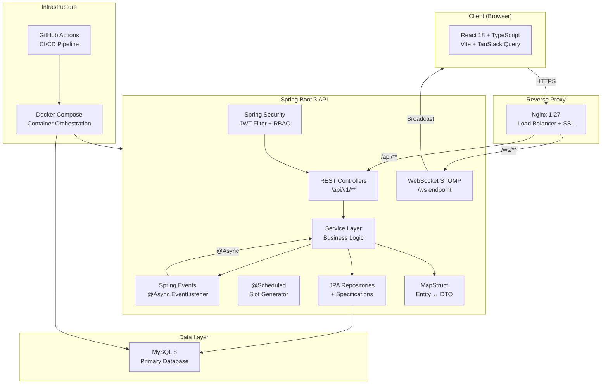
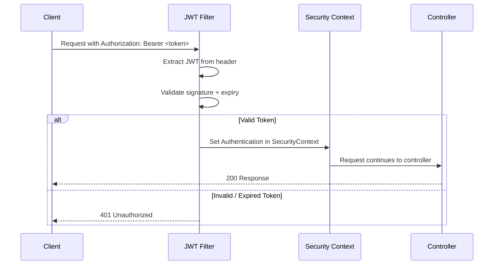

# SlotSync — System Architecture

## Overview

SlotSync follows a **clean layered architecture** with strict dependency rules:

```
Controller → Service (interface) → Repository → Domain Entity
                ↑
            DTO ↔ Mapper (MapStruct)
```

No layer may skip a layer below it. Entities are never exposed directly in API responses — all data flows through DTOs.

---

## High-Level Architecture Diagram



---

## Backend Package Structure

```
com.slotsync.backend/
│
├── config/                     # All Spring @Configuration classes
│   ├── AppConfig.java          # Custom property beans (JwtProperties, etc.)
│   ├── AsyncConfig.java        # Thread pool for @Async
│   ├── CorsConfig.java         # CORS configuration
│   ├── OpenApiConfig.java      # Swagger / OpenAPI 3
│   ├── SecurityConfig.java     # Spring Security filter chain
│   └── WebSocketConfig.java    # STOMP endpoint registration
│
├── controller/                 # REST API controllers (thin — delegate to services)
│   ├── AuthController.java
│   ├── BookingController.java
│   ├── ProviderController.java
│   ├── SlotController.java
│   ├── WaitlistController.java
│   ├── NotificationController.java
│   └── AdminController.java
│
├── service/                    # Business logic interfaces
│   ├── AuthService.java
│   ├── BookingService.java
│   ├── ProviderService.java
│   ├── SlotService.java
│   ├── WaitlistService.java
│   ├── NotificationService.java
│   ├── EmailService.java
│   └── AdminService.java
│
├── service/impl/               # Concrete service implementations
│   ├── AuthServiceImpl.java
│   ├── BookingServiceImpl.java  ← Core: @Transactional + pessimistic lock
│   ├── ProviderServiceImpl.java
│   ├── SlotServiceImpl.java
│   ├── WaitlistServiceImpl.java
│   ├── NotificationServiceImpl.java
│   ├── EmailServiceImpl.java    ← Graceful SMTP fallback
│   └── AdminServiceImpl.java
│
├── repository/                 # Spring Data JPA repositories
│   ├── UserRepository.java
│   ├── ProviderRepository.java
│   ├── SlotRepository.java      ← findByIdWithLock() PESSIMISTIC_WRITE
│   ├── BookingRepository.java
│   ├── WaitlistRepository.java
│   ├── NotificationRepository.java
│   ├── RefreshTokenRepository.java
│   └── AuditLogRepository.java
│
├── domain/                     # JPA entities (never exposed in API responses)
│   ├── User.java
│   ├── Provider.java
│   ├── Slot.java               ← @Version for optimistic locking
│   ├── Booking.java
│   ├── Waitlist.java
│   ├── Notification.java
│   ├── RefreshToken.java
│   └── AuditLog.java
│
├── dto/
│   ├── request/                # Incoming request DTOs (validated with @Valid)
│   │   ├── RegisterRequest.java
│   │   ├── LoginRequest.java
│   │   ├── CreateSlotRequest.java
│   │   ├── BookingRequest.java
│   │   └── ...
│   └── response/               # Outgoing response DTOs
│       ├── AuthResponse.java
│       ├── SlotResponse.java
│       ├── BookingResponse.java
│       ├── PagedResponse.java   ← Generic paginated wrapper
│       └── ...
│
├── mapper/                     # MapStruct interfaces (auto-generated impls)
│   ├── UserMapper.java
│   ├── ProviderMapper.java
│   ├── SlotMapper.java
│   ├── BookingMapper.java
│   └── NotificationMapper.java
│
├── event/                      # Spring domain events
│   ├── BookingConfirmedEvent.java
│   ├── BookingCancelledEvent.java
│   └── WaitlistPromotedEvent.java
│
├── exception/                  # Custom exceptions + global handler
│   ├── GlobalExceptionHandler.java   ← @RestControllerAdvice
│   ├── ResourceNotFoundException.java
│   ├── SlotNotAvailableException.java ← Maps to 409 Conflict
│   ├── DuplicateBookingException.java
│   ├── UnauthorizedException.java
│   └── ValidationException.java
│
├── security/                   # JWT security components
│   ├── JwtTokenProvider.java
│   ├── JwtAuthenticationFilter.java
│   └── UserDetailsServiceImpl.java
│
├── scheduler/                  # Recurring tasks
│   ├── RecurringSlotGeneratorJob.java
│   └── WaitlistCleanupJob.java
│
├── websocket/                  # WebSocket broadcasting
│   └── SlotBroadcastService.java
│
├── specification/              # JPA Specifications for dynamic queries
│   ├── ProviderSpecification.java
│   └── BookingSpecification.java
│
└── validation/                 # Custom Bean Validation annotations
    ├── FutureOrPresent.java
    └── ValidTimeRange.java
```

---

## Security Architecture



---

## Design Principles Applied

| Principle | Implementation |
|-----------|---------------|
| **Single Responsibility** | Each class has one reason to change (controllers only route, services only execute business logic) |
| **Open/Closed** | `BookingService` interface is open for extension (e.g., adding payment) without modifying consumers |
| **Liskov Substitution** | `EmailServiceImpl` can be swapped for `MockEmailService` in tests without breaking callers |
| **Interface Segregation** | Separate `BookingService`, `WaitlistService`, `NotificationService` instead of one God service |
| **Dependency Inversion** | All service consumers depend on interfaces, not implementations |
