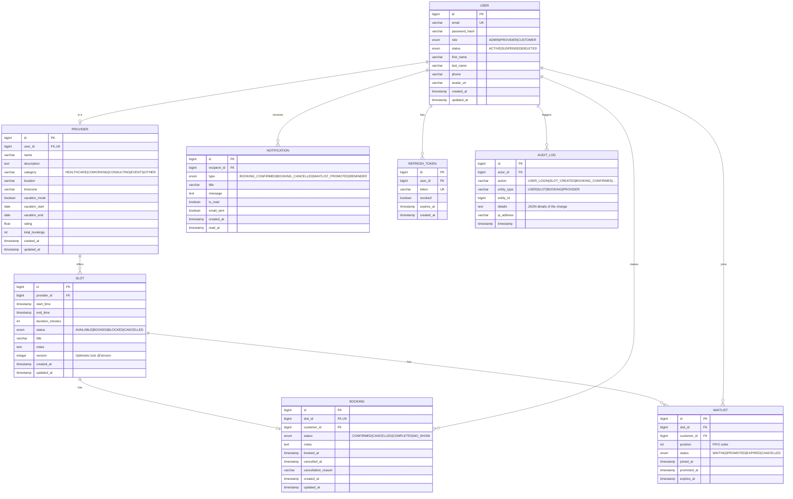

# SlotSync — Entity Relationship Diagram

## ER Diagram



---

## Entity Design Decisions

### `Slot.version` — Optimistic Locking
The `version` column is annotated with `@Version` in JPA. On every `UPDATE`, Hibernate appends `WHERE version = :expected` to the query. If two concurrent transactions update the same row, the second one fails with `OptimisticLockException`, which the service layer translates to `HTTP 409 Conflict`.

**Switching to Pessimistic Locking**: `SlotRepository.findByIdWithLock()` uses `@Lock(LockModeType.PESSIMISTIC_WRITE)` which issues `SELECT ... FOR UPDATE`. This is activated in high-concurrency scenarios by calling the lock-specific repository method instead of the standard `findById`.

### `Booking` ↔ `Slot` — One-to-One with Unique Constraint
The `slot_id` column on `Booking` has a `UNIQUE` constraint at the database level. This is the **second line of defense** against double booking (after the optimistic/pessimistic lock). Even if the application code has a race condition, the database constraint guarantees integrity.

### `Waitlist.position` — FIFO Ordering
`position` is assigned as `MAX(position) + 1` within the same slot. When a booking is cancelled, the waitlist entry with the lowest `position` and status `WAITING` is promoted atomically in a single transaction.

### `AuditLog.details` — JSON String
The details column stores a serialized JSON snapshot of what changed. This trades strict normalization for query simplicity — audit logs are append-only and rarely queried with complex joins.

---

## Indexes

```sql
-- Slot availability queries (most frequent read pattern)
CREATE INDEX idx_slot_provider_status    ON slot (provider_id, status);
CREATE INDEX idx_slot_provider_starttime ON slot (provider_id, start_time);

-- Booking history for a customer
CREATE INDEX idx_booking_customer        ON booking (customer_id, status);

-- Waitlist FIFO lookup
CREATE INDEX idx_waitlist_slot_position  ON waitlist (slot_id, position, status);

-- Notification feed
CREATE INDEX idx_notification_recipient  ON notification (recipient_id, is_read, created_at DESC);

-- Audit log queries
CREATE INDEX idx_audit_actor_time        ON audit_log (actor_id, timestamp DESC);
CREATE INDEX idx_audit_entity            ON audit_log (entity_type, entity_id);
```
