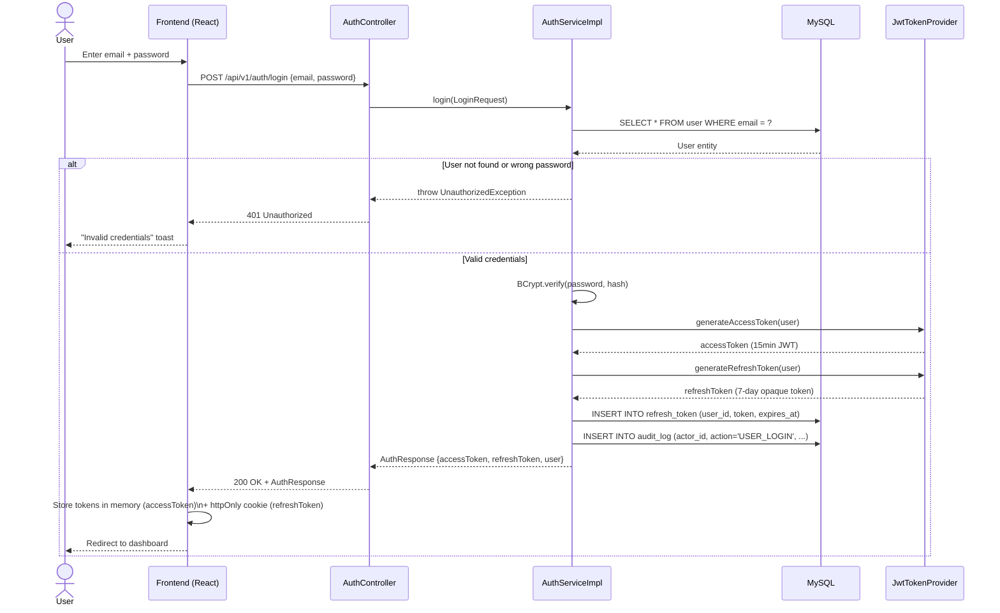
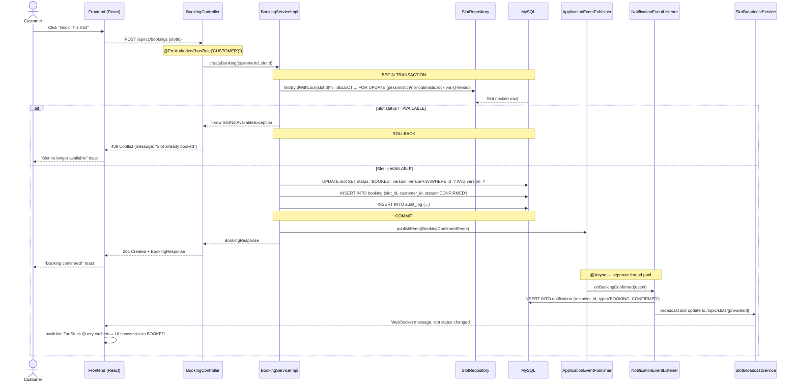
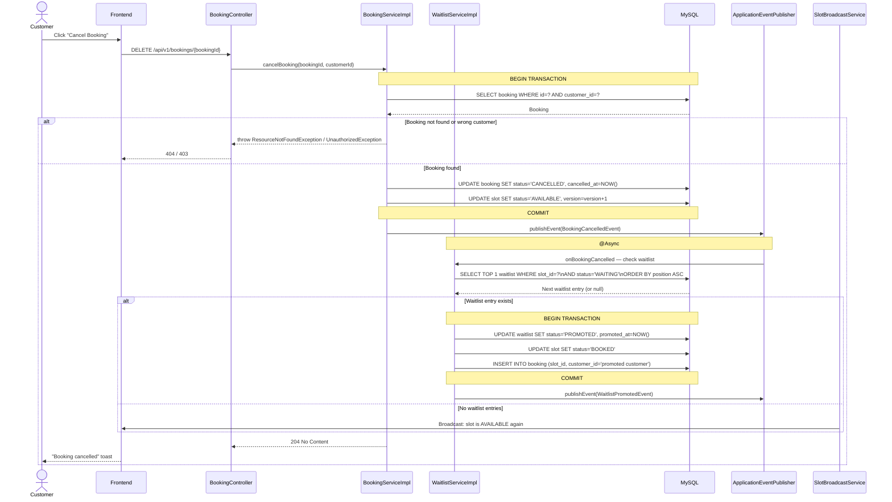
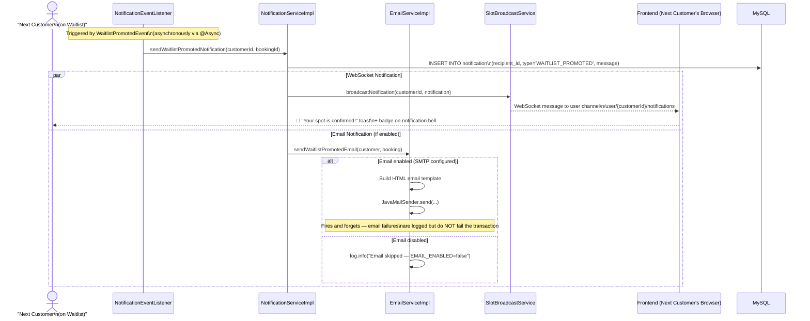

# SlotSync — Sequence Diagrams

## 1. Login Flow

```mermaid
sequenceDiagram
    actor User
    participant FE as Frontend (React)
    participant API as AuthController
    participant Svc as AuthServiceImpl
    participant DB as MySQL
    participant JWT as JwtTokenProvider

    User->>FE: Enter email + password
    FE->>API: POST /api/v1/auth/login {email, password}
    API->>Svc: login(LoginRequest)
    Svc->>DB: SELECT * FROM user WHERE email = ?
    DB-->>Svc: User entity

    alt User not found or wrong password
        Svc-->>API: throw UnauthorizedException
        API-->>FE: 401 Unauthorized
        FE-->>User: "Invalid credentials" toast
    else Valid credentials
        Svc->>Svc: BCrypt.verify(password, hash)
        Svc->>JWT: generateAccessToken(user)
        JWT-->>Svc: accessToken (15min JWT)
        Svc->>JWT: generateRefreshToken(user)
        JWT-->>Svc: refreshToken (7-day opaque token)
        Svc->>DB: INSERT INTO refresh_token (user_id, token, expires_at)
        Svc->>DB: INSERT INTO audit_log (actor_id, action='USER_LOGIN', ...)
        Svc-->>API: AuthResponse {accessToken, refreshToken, user}
        API-->>FE: 200 OK + AuthResponse
        FE->>FE: Store tokens in memory (accessToken)\n+ httpOnly cookie (refreshToken)
        FE-->>User: Redirect to dashboard
    end
```

---

## 2. Booking Flow (Zero Double-Booking Guarantee)

```mermaid
sequenceDiagram
    actor Customer
    participant FE as Frontend (React)
    participant API as BookingController
    participant Svc as BookingServiceImpl
    participant SlotRepo as SlotRepository
    participant DB as MySQL
    participant Events as ApplicationEventPublisher
    participant Listener as NotificationEventListener
    participant WS as SlotBroadcastService

    Customer->>FE: Click "Book This Slot"
    FE->>API: POST /api/v1/bookings {slotId}
    Note over API: @PreAuthorize("hasRole('CUSTOMER')")
    API->>Svc: createBooking(customerId, slotId)

    Note over Svc,DB: BEGIN TRANSACTION
    Svc->>SlotRepo: findByIdWithLock(slotId)\n= SELECT ... FOR UPDATE (pessimistic)\nor optimistic lock via @Version
    DB-->>SlotRepo: Slot (locked row)

    alt Slot status != AVAILABLE
        Svc-->>API: throw SlotNotAvailableException
        Note over Svc,DB: ROLLBACK
        API-->>FE: 409 Conflict {message: "Slot already booked"}
        FE-->>Customer: "Slot no longer available" toast
    else Slot is AVAILABLE
        Svc->>DB: UPDATE slot SET status='BOOKED', version=version+1\nWHERE id=? AND version=?
        Svc->>DB: INSERT INTO booking (slot_id, customer_id, status='CONFIRMED')
        Svc->>DB: INSERT INTO audit_log (...)
        Note over Svc,DB: COMMIT
        Svc->>Events: publishEvent(BookingConfirmedEvent)
        Svc-->>API: BookingResponse
        API-->>FE: 201 Created + BookingResponse
        FE-->>Customer: "Booking confirmed!" toast

        Note over Events,Listener: @Async — separate thread pool
        Events->>Listener: onBookingConfirmed(event)
        Listener->>DB: INSERT INTO notification (recipient_id, type='BOOKING_CONFIRMED')
        Listener->>WS: broadcast slot update to /topic/slots/{providerId}
        WS-->>FE: WebSocket message: slot status changed
        FE->>FE: Invalidate TanStack Query cache\n→ UI shows slot as BOOKED
    end
```

---

## 3. Booking Cancellation Flow

```mermaid
sequenceDiagram
    actor Customer
    participant FE as Frontend
    participant API as BookingController
    participant Svc as BookingServiceImpl
    participant WaitSvc as WaitlistServiceImpl
    participant DB as MySQL
    participant Events as ApplicationEventPublisher
    participant WS as SlotBroadcastService

    Customer->>FE: Click "Cancel Booking"
    FE->>API: DELETE /api/v1/bookings/{bookingId}
    API->>Svc: cancelBooking(bookingId, customerId)

    Note over Svc,DB: BEGIN TRANSACTION
    Svc->>DB: SELECT booking WHERE id=? AND customer_id=?
    DB-->>Svc: Booking

    alt Booking not found or wrong customer
        Svc-->>API: throw ResourceNotFoundException / UnauthorizedException
        API-->>FE: 404 / 403
    else Booking found
        Svc->>DB: UPDATE booking SET status='CANCELLED', cancelled_at=NOW()
        Svc->>DB: UPDATE slot SET status='AVAILABLE', version=version+1
        Note over Svc,DB: COMMIT

        Svc->>Events: publishEvent(BookingCancelledEvent)

        Note over Events,WaitSvc: @Async
        Events->>WaitSvc: onBookingCancelled — check waitlist
        WaitSvc->>DB: SELECT TOP 1 waitlist WHERE slot_id=?\nAND status='WAITING'\nORDER BY position ASC
        DB-->>WaitSvc: Next waitlist entry (or null)

        alt Waitlist entry exists
            Note over WaitSvc,DB: BEGIN TRANSACTION
            WaitSvc->>DB: UPDATE waitlist SET status='PROMOTED', promoted_at=NOW()
            WaitSvc->>DB: UPDATE slot SET status='BOOKED'
            WaitSvc->>DB: INSERT INTO booking (slot_id, customer_id='promoted customer')
            Note over WaitSvc,DB: COMMIT
            WaitSvc->>Events: publishEvent(WaitlistPromotedEvent)
        else No waitlist entries
            WS->>FE: Broadcast: slot is AVAILABLE again
        end

        Svc-->>API: 204 No Content
        FE-->>Customer: "Booking cancelled" toast
    end
```

---

## 4. Waitlist Promotion Flow

```mermaid
sequenceDiagram
    actor NextCustomer as "Next Customer\n(on Waitlist)"
    participant Listener as NotificationEventListener
    participant NotifSvc as NotificationServiceImpl
    participant EmailSvc as EmailServiceImpl
    participant WS as SlotBroadcastService
    participant FE as Frontend (Next Customer's Browser)
    participant DB as MySQL

    Note over Listener: Triggered by WaitlistPromotedEvent\n(asynchronously via @Async)
    Listener->>NotifSvc: sendWaitlistPromotedNotification(customerId, bookingId)
    NotifSvc->>DB: INSERT INTO notification\n(recipient_id, type='WAITLIST_PROMOTED', message)

    par WebSocket Notification
        NotifSvc->>WS: broadcastNotification(customerId, notification)
        WS-->>FE: WebSocket message to user channel\n/user/{customerId}/notifications
        FE-->>NextCustomer: 🎉 "Your spot is confirmed!" toast\n+ badge on notification bell
    and Email Notification (if enabled)
        NotifSvc->>EmailSvc: sendWaitlistPromotedEmail(customer, booking)
        alt Email enabled (SMTP configured)
            EmailSvc->>EmailSvc: Build HTML email template
            EmailSvc->>EmailSvc: JavaMailSender.send(...)
            Note over EmailSvc: Fires and forgets — email failures\nare logged but do NOT fail the transaction
        else Email disabled
            EmailSvc->>EmailSvc: log.info("Email skipped — EMAIL_ENABLED=false")
        end
    end
```
